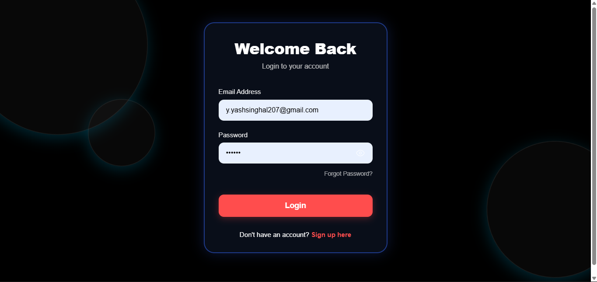

# TALKIFY - A Real-Time Chat System

A production-oriented Real-Time Chat Application built using Node.js, Express.js, Socket.IO, and MongoDB. The project focuses on scalable backend communication, low-latency messaging, and real-time user interactions similar to modern messaging platforms.

---

## Live Demo

Live Application: https://chat-talk-ten.vercel.app/login

### Application Preview



---

## Features

- Real-time messaging using Socket.IO
- Secure JWT-based Authentication & Authorization
- One-to-one and room-based communication
- Online/Offline user presence tracking
- Typing indicators
- Persistent chat history using MongoDB
- REST APIs for user and chat management
- Modular backend architecture
- Error handling and backend validations
- Scalable socket connection handling

---

## Tech Stack

### Backend
- Node.js
- Express.js
- Socket.IO
- MongoDB
- JWT Authentication

### Frontend
- HTML
- CSS
- JavaScript

---

## System Architecture

The application follows a modular client-server architecture:

1. Users authenticate using JWT tokens.
2. Express APIs manage authentication and chat operations.
3. Socket.IO handles real-time bidirectional communication.
4. MongoDB stores user data and message history.
5. Socket rooms manage private and group communication.

---

## Key Backend Engineering Concepts Used

- WebSocket-based real-time communication
- Event-driven architecture using Socket.IO
- REST API development with Express.js
- Authentication & authorization using JWT
- Database schema design using MongoDB
- Concurrent connection handling
- Scalable modular backend structure
- Asynchronous programming patterns

---

## Project Objectives

The main goal of this project was to build a backend-focused communication system capable of handling real-time workflows efficiently while maintaining scalability and reliability.

This project helped in gaining practical experience with:

- Distributed communication systems
- Backend API engineering
- Real-time event handling
- Low-latency messaging systems
- Production-oriented backend architecture

---

## Installation & Setup

### Clone the Repository

```bash
git clone https://github.com/yash-singhal-02/Real-Time-chat-system.git
```

### Navigate to Project Folder

```bash
cd Real-Time-chat-system
```

### Install Dependencies

```bash
npm install
```

### Start the Server

```bash
npm start
```

---

## Future Improvements

- AI-powered smart reply suggestions
- Message encryption
- File sharing support
- Voice and video calling
- Notification system
- Docker deployment support
- Observability and monitoring dashboards
- Redis-based scaling for distributed socket servers

---

## Why This Project Matters

This project demonstrates practical backend engineering skills beyond coursework and focuses on solving real-world communication problems using scalable backend systems.

It reflects hands-on experience with:

- Backend development
- Real-time systems
- Scalable architecture
- Production-focused engineering
- User-centric feature implementation

---

## Author

Yash Singhal

GitHub: https://github.com/yash-singhal-02
